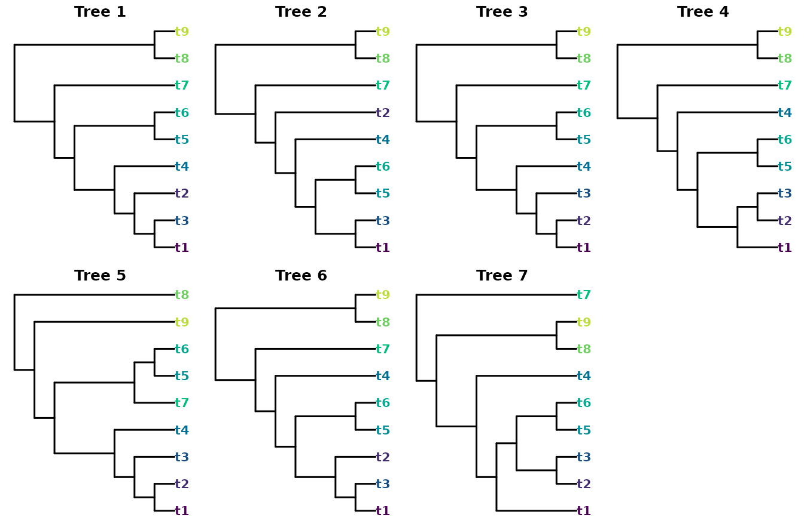
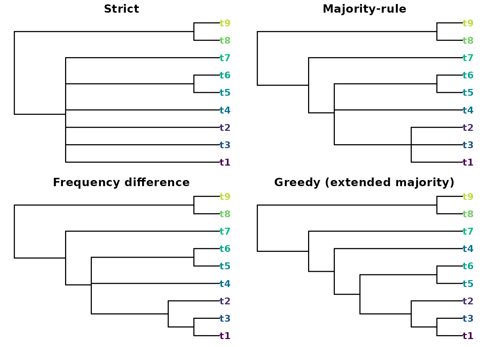
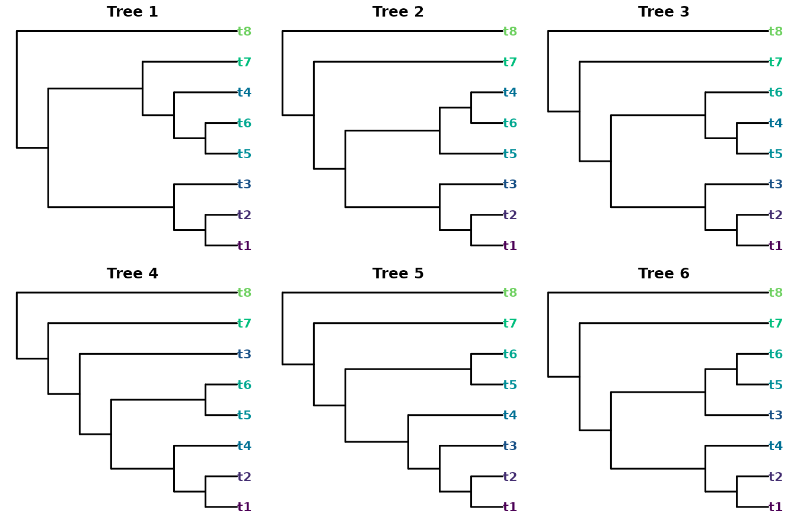
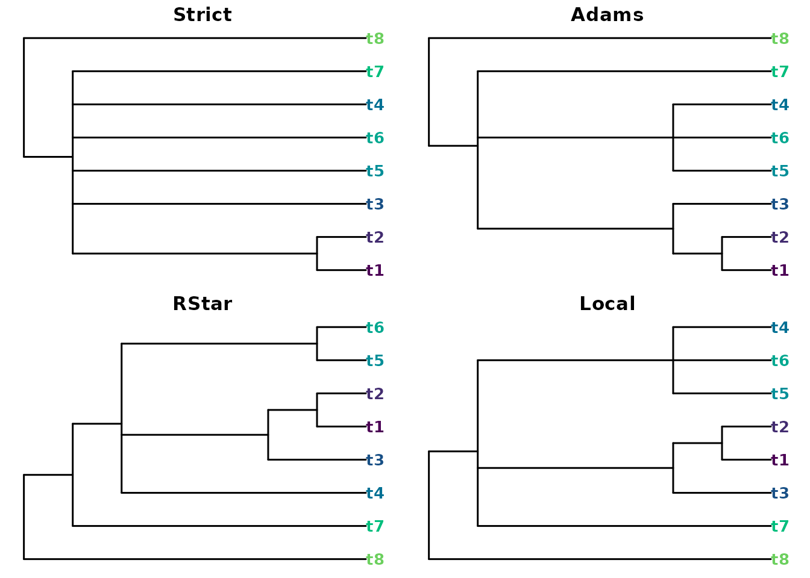
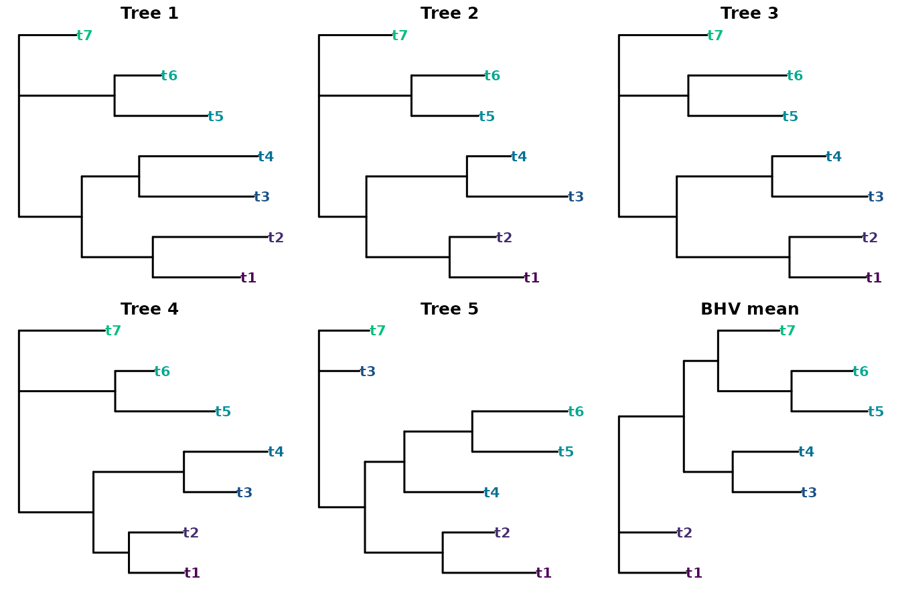

# Summarizing tree samples with ConsTree

‘ConsTree’ condenses a collection of phylogenetic trees – a bootstrap or
Bayesian posterior sample, say – into a single summary tree. The methods
fall into two families: those that select groupings (splits or clusters)
by some voting rule, and those that summarize the trees through a
distance or treespace criterion.

``` r

library("ConsTree")
library("TreeTools", quietly = TRUE)
```

## Split-selection methods

The split-selection methods differ only in *which* groupings they keep,
so they form a nested sequence of increasing resolution. To see this,
take seven trees that share a backbone but disagree on the placement of
a few leaves:

``` r

trees <- ape::read.tree(text = c(
  "((((((t1,t3),t2),t4),(t5,t6)),t7),(t8,t9));",
  "((((((t1,t3),(t5,t6)),t4),t2),t7),(t8,t9));",
  "((((((t1,t2),t3),t4),(t5,t6)),t7),(t8,t9));",
  "(((((t1,(t2,t3)),(t5,t6)),t4),t7),(t8,t9));",
  "((((((t1,t2),t3),t4),(t7,(t5,t6))),t9),t8);",
  "((((((t1,t3),t2),(t5,t6)),t4),t7),(t8,t9));",
  "((((t1,((t2,t3),(t5,t6))),t4),(t8,t9)),t7);"))
```

A consistent colour marks each leaf, so the eye can follow a leaf from
one tree to the next.

``` r

nTip <- 9
leafCol <- setNames(hcl.colors(nTip + 1), TipLabels(nTip + 1))
plotCons <- function(tree, main = "") {
  plot(tree, tip.color = leafCol[tree$tip.label], main = main,
       font = 2, cex = 1, edge.width = 1.5)
}
```

``` r

oldPar <- par(mfrow = c(2, 4), mar = c(0.5, 0.5, 1.5, 0.5))
for (i in seq_along(trees)) plotCons(trees[[i]], main = paste("Tree", i))
par(oldPar)
```



Each method retains a superset of the groupings kept by the one before
it:

``` r

data.frame(
  method  = c("Strict", "Majority", "Frequency", "Greedy"),
  splits  = c(NSplits(Strict(trees)),    NSplits(Majority(trees)),
              NSplits(Frequency(trees)),  NSplits(Greedy(trees)))
)
#>      method splits
#> 1    Strict      2
#> 2  Majority      4
#> 3 Frequency      5
#> 4    Greedy      6
```

``` r

oldPar <- par(mfrow = c(2, 2), mar = c(0.5, 0.5, 1.5, 0.5))
plotCons(Strict(trees),    "Strict")
plotCons(Majority(trees),  "Majority-rule")
plotCons(Frequency(trees), "Frequency difference")
plotCons(Greedy(trees),    "Greedy (extended majority)")
```



``` r

par(oldPar)
```

[`Strict()`](https://constree.github.io/reference/Strict.md) keeps only
the two groupings present in every tree;
[`Majority()`](https://constree.github.io/reference/Majority.md) adds
those in more than half;
[`Frequency()`](https://constree.github.io/reference/Frequency.md) keeps
a grouping that beats every grouping it conflicts with; and
[`Greedy()`](https://constree.github.io/reference/Greedy.md) adds
compatible groupings most frequent first, giving the most resolved
summary.

Two further rules apply different conflict criteria rather than a
frequency threshold.
[`Loose()`](https://constree.github.io/reference/Loose.md) (the
semi-strict, or combinable-component, consensus) keeps every grouping
that *no* tree contradicts, and
[`MajorityPlus()`](https://constree.github.io/reference/MajorityPlus.md)
keeps a grouping displayed by more trees than contradict it. Because the
default [`Majority()`](https://constree.github.io/reference/Majority.md)
threshold (`p = 0.5`) admits a grouping seen in exactly half the trees,
even when the other half contradict it,
[`Majority()`](https://constree.github.io/reference/Majority.md) is
*not* always a subset of
[`MajorityPlus()`](https://constree.github.io/reference/MajorityPlus.md).

## Rooted methods

[`Adams()`](https://constree.github.io/reference/Adams.md),
[`RStar()`](https://constree.github.io/reference/RStar.md) and
[`Local()`](https://constree.github.io/reference/Local.md) treat the
input as **rooted** and reason about clusters and rooted triplets rather
than unrooted splits. They can therefore recover structure that the
unrooted strict consensus collapses:

``` r

rTrees <- ape::read.tree(text = c(
  "((((t1,t2),t3),(((t5,t6),t4),t7)),t8);",
  "(((((t1,t2),t3),(t5,(t6,t4))),t7),t8);",
  "(((((t1,t2),t3),((t5,t4),t6)),t7),t8);",
  "((((((t1,t2),t4),(t5,t6)),t3),t7),t8);",
  "((((((t1,t2),t3),t4),(t5,t6)),t7),t8);",
  "(((((t1,t2),t4),(t3,(t5,t6))),t7),t8);"))
```

``` r

oldPar <- par(mfrow = c(2, 3), mar = c(0.5, 0.5, 1.5, 0.5))
for (i in seq_along(rTrees)) plotCons(rTrees[[i]], main = paste("Tree", i))
```



``` r

par(oldPar)
```

``` r

data.frame(
  method = c("Strict", "Adams", "RStar", "Local"),
  splits = c(NSplits(Strict(rTrees)), NSplits(Adams(rTrees)),
             NSplits(RStar(rTrees)),  NSplits(Local(rTrees)))
)
#>   method splits
#> 1 Strict      1
#> 2  Adams      3
#> 3  RStar      4
#> 4  Local      3
```

The unrooted strict consensus keeps a single grouping, but the rooted
methods recover more:

``` r

oldPar <- par(mfrow = c(2, 2), mar = c(0.5, 0.5, 1.5, 0.5))
plotCons(Strict(rTrees), "Strict")
plotCons(Adams(rTrees),  "Adams")
plotCons(RStar(rTrees),  "RStar")
plotCons(Local(rTrees),  "Local")
```



``` r

par(oldPar)
```

[`Adams()`](https://constree.github.io/reference/Adams.md) may introduce
groupings present in no input tree;
[`RStar()`](https://constree.github.io/reference/RStar.md) keeps each
rooted triplet that wins a plurality over both alternatives; and
[`Local()`](https://constree.github.io/reference/Local.md) returns the
minimum local consensus of the shared triplets (limited to 20 leaves,
and best suited to congruent samples).

## Distance and branch-length summaries

A second family ignores grouping frequencies and instead seeks a tree
close to the sample under a chosen criterion.

The majority-rule tree has a tidy optimality property: it is the
*median* tree under the Robinson–Foulds metric – the tree whose total RF
distance to the sample is smallest.
[`Quartet()`](https://constree.github.io/reference/Quartet.md) is the
quartet-distance analogue, seeking (an approximation to) the tree that
minimizes the total quartet distance to the inputs instead. Because the
quartet distance gives extra weight to deep branches, the result is
often *more* resolved than the majority-rule tree:

``` r

c(majority = NSplits(Majority(trees)),
  quartet  = NSplits(Quartet(trees)))
#> majority  quartet 
#>        4        5
```

When the trees carry **branch lengths**, two further summaries become
available.
[`Average()`](https://constree.github.io/reference/Average.md) returns
the tree whose path-length (patristic) distances best match the average
of the input distance matrices, while
[`BHVMean()`](https://constree.github.io/reference/BHVMean.md) computes
the Fréchet mean in Billera–Holmes–Vogtmann treespace, with branch
lengths;
[`BHVDistance()`](https://constree.github.io/reference/BHVDistance.md),
`BHVPairwiseDistances()` and
[`BHVVariance()`](https://constree.github.io/reference/BHVMean.md)
provide the underlying geodesic distances and dispersion.

The Fréchet mean only resolves a grouping that the geodesics actually
support. Given a sample of mutually near-random trees, every internal
branch of the mean is dragged to (almost) zero length: the result is
formally resolved but plots as a star, which is useless to look at. To
show the method’s behaviour we instead need trees that share a backbone.
Here four of five trees agree on the topology, differing only in branch
length, while the fifth rearranges one clade:

``` r

blTrees <- ape::read.tree(text = c(
  "(((t1:0.64,t2:0.84):0.52,(t3:0.84,t4:0.87):0.42):0.46,(t5:0.68,t6:0.34):0.70,t7:0.42);",
  "(((t1:0.64,t2:0.40):0.72,(t3:0.87,t4:0.38):0.87):0.41,(t5:0.58,t6:0.63):0.80,t7:0.63);",
  "(((t1:0.53,t2:0.50):0.78,(t3:0.66,t4:0.37):0.66):0.40,(t5:0.65,t6:0.68):0.48,t7:0.61);",
  "(((t1:0.48,t2:0.47):0.31,(t3:0.46,t4:0.73):0.79):0.65,(t5:0.87,t6:0.34):0.84,t7:0.75);",
  "(((t1:0.85,t2:0.47):0.71,(t4:0.72,(t5:0.78,t6:0.87):0.62):0.36):0.42,t3:0.37,t7:0.46);"))
meanTree <- BHVMean(blTrees)
oldPar <- par(mfrow = c(2, 3), mar = c(0.5, 0.5, 1.5, 0.5))
for (i in seq_along(blTrees)) plotCons(blTrees[[i]], main = paste("Tree", i))
plotCons(meanTree, main = "BHV mean")
```



``` r

par(oldPar)
```

``` r

BHVVariance(blTrees, mean = meanTree)
#> [1] 0.5749739
```

The mean recovers the shared topology, but its internal branches are not
simple arithmetic averages. The two groupings that every tree displays
keep their full length, whereas the two that the fifth tree contradicts
are pulled noticeably shorter – the geodesic to a tree that lacks a
branch shrinks that branch on the way, so disagreement is expressed as
shortening rather than collapse.

## Choosing a method

As a rule of thumb:
[`Strict()`](https://constree.github.io/reference/Strict.md) and
[`Loose()`](https://constree.github.io/reference/Loose.md) when you want
only well-supported groupings;
[`Majority()`](https://constree.github.io/reference/Majority.md) for the
familiar bootstrap summary;
[`Frequency()`](https://constree.github.io/reference/Frequency.md),
[`Greedy()`](https://constree.github.io/reference/Greedy.md) or
[`Quartet()`](https://constree.github.io/reference/Quartet.md) for a
more resolved picture; the rooted methods when a root is meaningful; and
[`Average()`](https://constree.github.io/reference/Average.md) or
[`BHVMean()`](https://constree.github.io/reference/BHVMean.md) when
branch lengths matter.

Where no constructed consensus is wanted, the
[‘TreeDist’](https://ms609.github.io/TreeDist/) package offers a
complementary approach: it can return the sampled tree with the lowest
median clustering-information distance to the rest – a single
*representative* of the sample rather than a summary built from its
parts. And the [‘Rogue’](https://ms609.github.io/Rogue/) package can
first strip unstable (‘rogue’) leaves, often sharpening any of the
consensus trees above.
